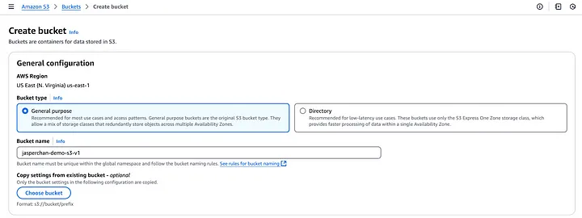

# Static-Website-Hosting-on-AWS

## Introduction:
This project includes hosting a static website using S3, implementing CloudFront for content delivery, using Route 53 for domain management (optional), and enabling HTTPS with ACM (optional). Additionally, it involves configuring an IAM role to manage access securely.

## Architecture Overview: 

## Creating an IAM role

1. Navigate to Access Management -> Roles -> Create Role

2. Select AWS service as the trusted entity type and S3 as your use case. Click on Next.

3. From the list of permission policies, choose the following policies:

    *AmazonS3FullAccess*: To manage the S3 bucket.

    *CloudFrontFullAccess*: To manage CloudFront distributions.

    *AWSCertificateManagerReadOnly: To read SSL/TLS certificates.

    *AmazonRoute53FullAccess* (optional): To manage domain records.

4. Click on Next. Provide a suitable name and description for the IAM role and click on Create role.

## Creating a S3 bucket

1. From your AWS management console, search for S3 from the search bar.

2. Click on Create bucket.

3. Give a suitable name for the S3 bucket, keep the rest of the configurations as it is and click on Create bucket.

4. Upload website files: Open the bucket -> click Upload -> Upload your static files (e.g. index.html, styles.css).

5. Enable Static Website Hosting: Go to the Properties tab -> Static Website Hosting -> Enable it. Enter Index document: index.html and optionally Error document: error.html

6. Update the bucket policy and copy the Bucket ARN on it. Besides, it can restrict access to the IAM role if necessary.

7. Test the S3 bucket: Access the bucket’s Static Website Hosting Endpoint

## Set Up CloudFront for Content Delivery

1. From your AWS management console, search for CloudFront from the search bar.

2. Click Create Distribution. Typing your S3 static Website Endpoint URL (e.g., http://my-static-website.s3-website-us-east-1.amazonaws.com).

3. Origin Protocol Policy: Select HTTP Only since the S3 static website endpoint does not support HTTPS.

4. Under the Default Cache Behavior Settings -> Viewer Protocol Policy: Set to Redirect HTTP to HTTPS to ensure secure access.

5. Allowed HTTP Methods: Choose GET, HEAD (recommended for static websites). And leave other settings as default and click Create Distribution.

6. The distribution may take 10–15 minutes to deploy. Once deployed, it will display a Domain Name (e.g., https://d12345678.cloudfront.net).

7. Test the Distribution: Open the CloudFront Domain Name in your browser to verify the website is accessible.

## Configure Route 53 for Custom Domain

1. From your AWS management console, search for Route 53 from the search bar.

2. Register a Domain (if you don’t already have one): Search for your desired domain (e.g., example.com) and complete the purchase.

3. Create a Hosted Zone:

In Route 53, go to Hosted Zones → Click Create Hosted Zone. Enter your domain name (e.g., example.com) and select the Public Hosted Zone option.

4. Add DNS Records: Open the hosted zone you just created. Click Create Record and configure the following:

• Record Name: Leave blank or enter www (e.g., www.example.com).

• Record Type: Select A (Alias).

• Alias Target: Select your CloudFront distribution from the dropdown.

• Save the record.

5. Test the Domain:

• Open your custom domain (e.g., https://www.example.com) in a browser and verify it maps to your website.

## Enable HTTPS Using ACM

From your AWS management console, search for Certificate Manager from the search bar.

2. Request a Public SSL Certificate: Open the ACM Console. Click Request a Certificate → Select Request a Public Certificate.

Then, Enter your domain name(s): for example, using both example.com and www.example.com to ensure proper coverage. Next, choosing DNS Validation for faster and easier validation.

3. Validate the Certificate: ACM generates a CNAME record for validation. Then, Go to the Route 53 Console and open your hosted zone. By adding the generated CNAME record to your domain’s DNS settings:

• Name: The name provided by ACM.

• Value: The target value provided by ACM.

ACM will automatically validate the domain once the DNS record is set correctly.

4. Attach the Certificate to CloudFront: Open the CloudFront Console. Edit your CloudFront distribution settings:

• Under SSL/TLS Settings, select Custom SSL Certificate.

• Choose the ACM certificate you validated earlier.

• Save changes and wait for the distribution to deploy.

5. Test HTTPS:

• Open your website using the custom domain (e.g., https://www.example.com) and confirm HTTPS is working.

